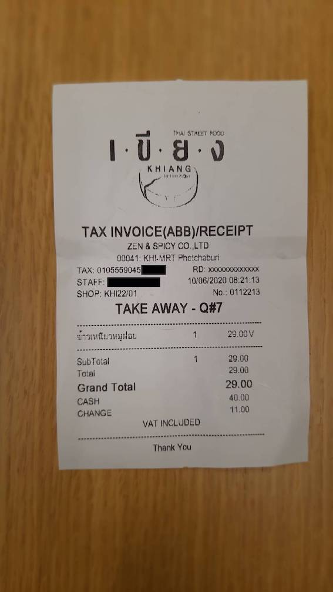
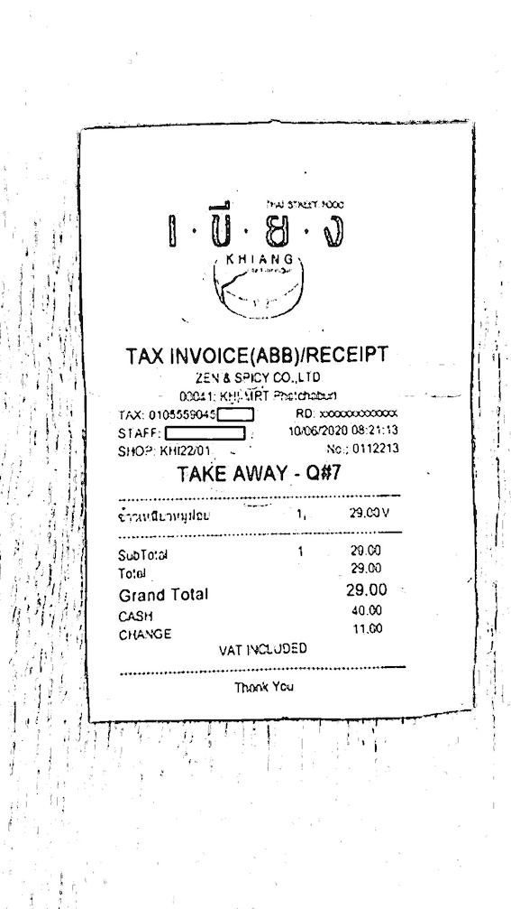

# OCR: Image Binarization
This Jupyter notebook is demo of image binarization technique that really helpful when do an OCR project.

Also, there are other notebooks that show how to combine the image processing with Amazon Rekognition to do text extraction after processed the image.

## How To
1. The notebook will read image from Amazon S3.
2. Then do the image processing with open-source library (opencv) to do binarization.
3. Then save the processed image back to Amazon S3.

## Image Demo
Source image

Target image

